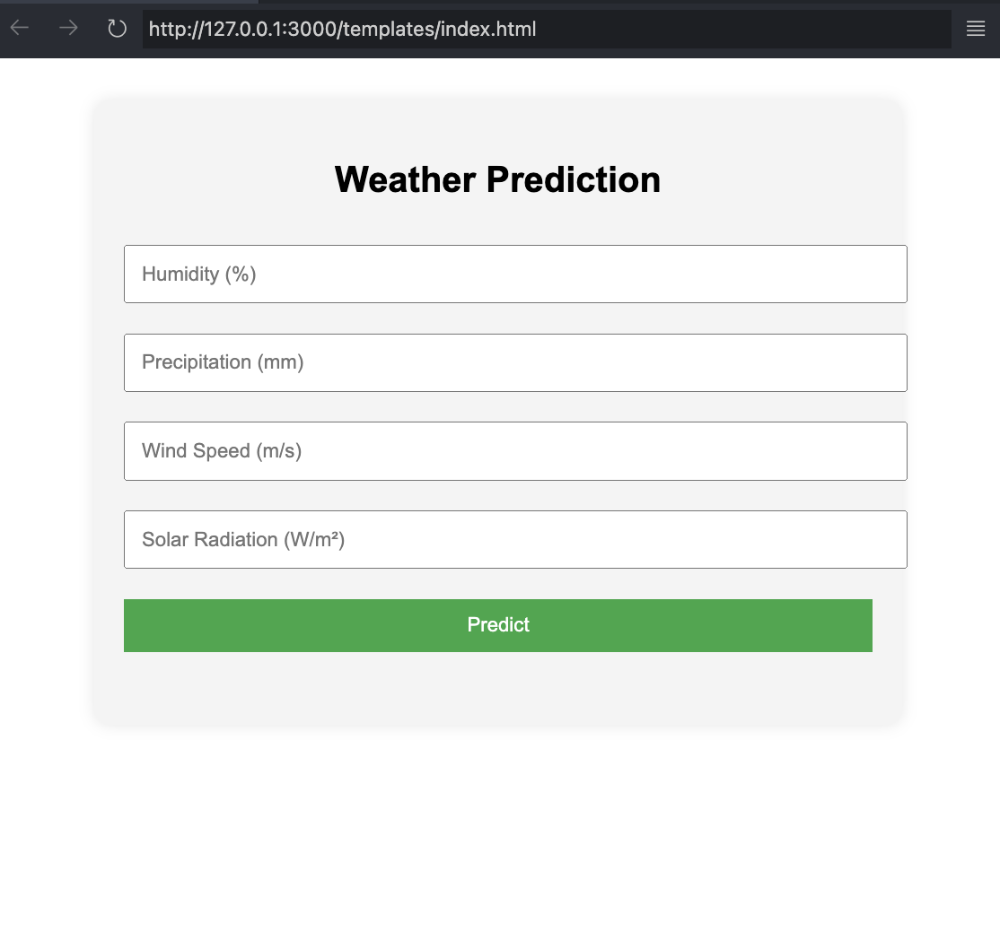

# Sri Lanka Weather Prediction ML

A Machine Learning-based weather prediction application designed to analyze weather patterns and provide accurate forecasts for Sri Lanka.

## Features

- Predicts weather conditions using a trained machine learning model.
- Utilizes a dataset specific to Sri Lanka's weather patterns.
- Includes a web-based interface for user interaction.

## Project Structure

```
├── app.py                  # Main application script
├── scaler.pkl              # Scaler used for preprocessing data
├── weather_model.pkl       # Trained machine learning model
├── SriLanka_Weather_Dataset.csv # Dataset used for training the model
├── weather.ipynb           # Jupyter Notebook for model training and analysis
├── templates/
│   └── index.html          # HTML template for the web interface
├── LICENSE                 # License information
├── README.md               # Project documentation
└── screenshot.png          # Screenshot of the application
```


 Run the application:
   ```bash
   python app.py
   ```

## Dataset

The project uses the `SriLanka_Weather_Dataset.csv` file, which contains historical weather data for Sri Lanka. Ensure this file is in the root directory before running the application.

## Usage

1. Start the application by running `app.py`.
2. Open your browser and navigate to `http://127.0.0.1:5000`.
3. Enter the required inputs to get weather predictions.

## Screenshots



## Model Training

The model was trained using the `weather.ipynb` notebook. You can retrain the model by running the notebook and saving the updated `weather_model.pkl`.

## License

This project is licensed under the terms of the [LICENSE](LICENSE) file.
